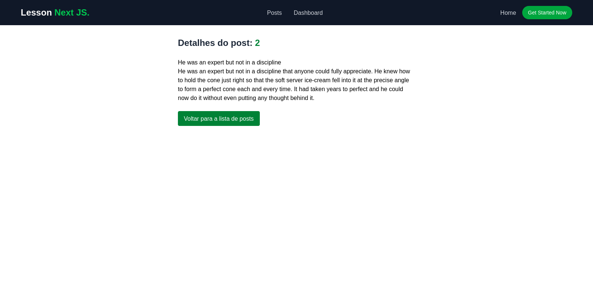

# Lesson Next.js

Este é um projeto de aprendizado Next.js que demonstra conceitos fundamentais do framework, incluindo roteamento, componentes, middleware, Server Actions e muito mais.

## 🧭 Guia de Navegação (Índice)

- **[🎯 Sobre o Projeto](#sobre-o-projeto)**
- **[📸 Ilustração](#ilustracao)**
- **[🚀 Tecnologias Utilizadas](#tecnologias-utilizadas)**
- **[📁 Estrutura do Projeto](#estrutura-do-projeto)**
- **[💻 Instalação e Execução](#instalacao-e-execucao)**
- **[✨ Funcionalidades](#funcionalidades)**
- **[🛣️ Rotas Disponíveis](#rotas-disponiveis)**
- **[🧩 Componentes](#componentes)**
- **[🛡️ Middleware](#middleware)**
- **[🔄 Estratégias de Cache](#estrategias-de-cache)**
- **[📄 Licença](#licenca)**

## 🎯 Sobre o Projeto <a name="sobre-o-projeto"></a>

Este projeto foi desenvolvido para ensinar e demonstrar os principais conceitos do Next.js 15, incluindo:

- App Router
- Server Components e Client Components
- Server Actions
- Middleware para autenticação
- Static Site Generation (SSG)
- Incremental Static Regeneration (ISR)
- API Routes
- Tratamento de erros e páginas 404

## 📸 Ilustração <a name="ilustracao"></a>

- ### _HOME:_


- ### _POSTS:_


- ### _POST:_



## 🚀 Tecnologias Utilizadas <a name="tecnologias-utilizadas"></a>

- **Next.js 15.4.1** - Framework React para produção
- **React 19.1.0** - Biblioteca para interfaces de usuário
- **TypeScript** - Superset tipado do JavaScript
- **Tailwind CSS 4** - Framework CSS utilitário
- **PostCSS** - Ferramenta para transformação CSS

## 📁 Estrutura do Projeto <a name="estrutura-do-projeto"></a>

```
lesson/
├── src/
│   ├── app/
│   │   ├── api/info/           # API Route para informações de perfil
│   │   ├── posts/              # Páginas de posts
│   │   │   └── [id]/           # Página dinâmica de post individual
│   │   ├── dashboard/          # Página protegida do dashboard
│   │   ├── contatos/           # Página de contatos
│   │   ├── layout.tsx          # Layout raiz da aplicação
│   │   ├── page.tsx            # Página inicial
│   │   ├── not-found.tsx       # Página 404 customizada
│   │   └── globals.css         # Estilos globais
│   ├── components/
│   │   ├── header/             # Componente de cabeçalho
│   │   └── button/             # Componente de botão interativo
│   └── middleware.ts           # Middleware de autenticação
├── public/                     # Arquivos estáticos
├── package.json               # Dependências e scripts
├── tsconfig.json              # Configuração TypeScript
├── next.config.ts             # Configuração Next.js
└── postcss.config.mjs         # Configuração PostCSS
```

## 💻 Instalação e Execução <a name="instalacao-e-execucao"></a>

### Pré-requisitos

- Node.js (versão 18 ou superior)
- npm, yarn, pnpm ou bun

### Instalação

1. Clone o repositório:

   ```bash
   git clone https://github.com/0nF1REy/lesson-next-js.git
   cd lesson-next-js
   ```

2. Navegue até a pasta do projeto:

   ```bash
   cd lesson
   ```

3. Instale as dependências:

   ```bash
   npm install

   # ou
   yarn install

   # ou
   pnpm install
   ```

### Execução

Para executar o projeto em modo de desenvolvimento:

```bash
npm run dev

# ou
yarn dev

# ou
pnpm dev
```

Abra [http://localhost:3000](http://localhost:3000) no seu navegador para ver o resultado.

## ✨ Funcionalidades <a name="funcionalidades"></a>

### 🏠 Página Inicial

- Geração de números aleatórios
- Revalidação automática a cada 60 segundos
- Meta tags otimizadas para SEO

### 📝 Sistema de Posts

- Lista de posts fetchados da API DummyJSON
- Página individual para cada post
- Sistema de loading com Suspense
- Cache e revalidação configurados
- Busca de posts por usuário

### 🔐 Dashboard Protegido

- Middleware de autenticação
- Redirecionamento automático para não autenticados

### 🎨 Componentes Interativos

- Botão com estado local (useState)

## 🛣️ Rotas Disponíveis <a name="rotas-disponiveis"></a>

| Rota          | Descrição               | Tipo      |
| ------------- | ----------------------- | --------- |
| `/`           | Página inicial          | Static    |
| `/posts`      | Lista de posts          | ISR (60s) |
| `/posts/[id]` | Post individual         | Dynamic   |
| `/dashboard`  | Dashboard protegido     | Protected |
| `/contatos`   | Página de contatos      | Static    |
| `/api/info`   | API com dados de perfil | API Route |

## 🧩 Componentes <a name="componentes"></a>

### HeaderComponent

Localizado em [`src/components/header/header.tsx`](lesson/src/components/header/header.tsx)

- Navegação responsiva
- Links para todas as páginas
- Design com Tailwind CSS

### ButtonComponent

Localizado em [`src/components/button/button.tsx`](lesson/src/components/button/button.tsx)

- Componente client-side
- Gerenciamento de estado com useState
- Funcionalidade de alteração de nome

## 🛡️ Middleware <a name="middleware"></a>

O middleware em [`src/middleware.ts`](lesson/src/middleware.ts) implementa:

- Proteção de rotas do dashboard
- Redirecionamento para usuários não autenticados
- Verificação de autenticação (atualmente configurado como `false` para demonstração)

## 🔄 Estratégias de Cache <a name="estrategias-de-cache"></a>

- **ISR**: Posts revalidados a cada 60 segundos
- **Force Cache**: Cache forçado para dados de posts
- **Revalidate**: Configuração de revalidação personalizada

## 📄 Licença <a name="licenca"></a>

Este projeto é destinado para fins educacionais e de aprendizado.

---

**Desenvolvido como parte do aprendizado de Next.js** 🚀
